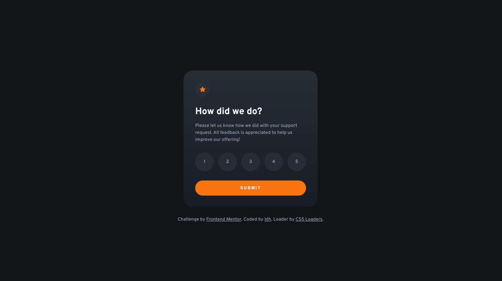

# Frontend Mentor - Interactive rating component solution

This is a solution to the [Interactive rating component challenge on Frontend Mentor](https://www.frontendmentor.io/challenges/interactive-rating-component-koxpeBUmI). Frontend Mentor challenges help you improve your coding skills by building realistic projects.

## Table of contents

- [Overview](#overview)
  - [The challenge](#the-challenge)
  - [Screenshot](#screenshot)
  - [Links](#links)
- [My process](#my-process)
  - [Built with](#built-with)
  - [Continued development](#continued-development)
  - [Useful resources](#useful-resources)
- [Author](#author)
- [Acknowledgments](#acknowledgments)

## Overview

### The challenge

Users should be able to:

- View the optimal layout depending on their device's screen size
- See hover and focus states for interactive elements

### Screenshot

### Links

- Solution URL: [solution URL](https://github.com/LukeDHarrison/interactive-rating-card-solution)
- Live Site URL: [live site URL](https://interactive-rating-card-solution.netlify.app/)

## My process

### Built with

- Semantic HTML5 markup
- CSS custom properties
- Flexbox
- CSS Variables
- Javascript

### Continued development

Connecting the form to a database and using more robust client-side form validation.

### Useful resources

CSS Loading animation is from CSS Loaders
. [Check out them out here!](https://cssloaders.github.io/)

## Author

- Website - [Luke D Harrison](https://www.your-site.com)
- Frontend Mentor - [@LukeDHarrison](https://www.frontendmentor.io/profile/LukeDHarrison)
- Twitter - [@LukeDHarrison\_](https://twitter.com/LukeDHarrison_)
